# URCALLS Application Infrastructure Guide

## Table of Contents
1. [Infrastructure Overview](#infrastructure-overview)
2. [Hetzner Cloud Environment](#hetzner-cloud-environment)
3. [Development and CI/CD Pipeline](#development-and-cicd-pipeline)
4. [System Components](#system-components)
5. [Monitoring and Maintenance](#monitoring-and-maintenance)
6. [Security and Best Practices](#security-and-best-practices)
7. [Troubleshooting and Support](#troubleshooting-and-support)
8. [Infrastructure Diagram](#infrastructure-diagram)
9. [Data Flow Patterns](#data-flow-patterns)
10. [Resource Requirements](#resource-requirements)
11. [Monitoring and Maintenance](#monitoring-and-maintenance)
12. [Cost Calculations](#cost-calculations)
13. [Github Stregies](#github-stregies)
14. [DevOps Tools & Infrastructure Stack](#devOps-tools-&-infrastructure-stack)

## Infrastructure Overview

### What Are We Building?
Our video call application is a modern, scalable solution that provides:
- High-quality video conferencing
- AI-powered real-time translations
- Automatic captions
- Scalable infrastructure

### Core Components (Non-Technical Explanation)
1. **Front Door (Load Balancer)**
   - Like a smart receptionist directing visitors
   - Ensures everyone gets to the right service
   - Prevents overcrowding

2. **Video Service (LiveKit)**
   - Think of it as a sophisticated video control room
   - Handles all video and audio streams
   - Makes sure everyone can see and hear each other

3. **AI Services**
   - Like having real-time translators
   - Provides instant captions
   - Helps make meetings more accessible

## Hetzner Cloud Environment

### What is Hetzner Cloud?
- A reliable and cost-effective cloud provider
- Like renting powerful computers in a secure facility
- Allows us to scale up or down as needed

### Our Setup in Hetzner
1. **Private Network (10.0.2.0/24)**
   - Secure, isolated environment
   - Like having a private office building
   - Controlled access points

2. **Different Service Areas**
   - Standard Services: Regular day-to-day operations
   - High-Performance Area: For AI and intensive processing
   - Special Video Area: Dedicated to video handling

3. **Storage Systems**
   - Fast temporary storage (Redis)
   - Reliable permanent storage (Database)
   - Message handling system (RabbitMQ)

## Development and CI/CD Pipeline


### Building and Testing (For Non-Technical Readers)
1. **Quality Checks**
   - Automatic code testing
   - Security scanning
   - Performance verification

2. **Deployment Process**
   - Safe and automated
   - Step-by-step verification
   - Easy rollback if needed

### Tools We Use
1. **Jenkins (Our Building Factory)**
   - Automates testing and deployment
   - Ensures quality standards
   - Maintains consistency

2. **SonarQube (Quality Inspector)**
   - Checks for potential problems
   - Ensures code security
   - Maintains standards

3. **Docker (Packaging System)**
   - Bundles everything needed
   - Ensures consistency
   - Makes deployment reliable

## System Components

### Video Handling (LiveKit)
- Three dedicated servers
- Handles all video streams
- Ensures smooth communication

### AI Processing
1. **Translation Service**
   - Real-time language translation
   - Multiple language support
   - Low latency processing

2. **Caption Service**
   - Live speech-to-text
   - Multiple language support
   - Synchronized with video

### Data Management
1. **Cache System (Redis)**
   - Quick access to frequent data
   - Improves response times
   - Reduces database load

2. **Main Database**
   - Stores all permanent data
   - Secure and backed up
   - Easily scalable

## Monitoring and Maintenance

### Health Monitoring
1. **Performance Tracking**
   - Real-time monitoring
   - Early warning system
   - Performance optimization

2. **Usage Metrics**
   - User statistics
   - Resource utilization
   - Cost optimization

### Regular Maintenance
1. **Updates and Patches**
   - Regular security updates
   - Feature improvements
   - Performance optimization

2. **Backup Systems**
   - Regular data backups
   - Multiple backup locations
   - Quick recovery options

## Security and Best Practices

### Security Measures
1. **Network Security**
   - Private network isolation
   - Encrypted connections
   - Regular security audits

2. **Access Control**
   - User authentication
   - Service authentication
   - Role-based access

### Best Practices
1. **Scaling Guidelines**
   - Automatic scaling rules
   - Resource optimization
   - Cost management

2. **Disaster Recovery**
   - Backup procedures
   - Recovery plans
   - Business continuity

## Troubleshooting and Support

### Common Scenarios
1. **Performance Issues**
   - Automatic detection
   - Quick resolution
   - Prevention measures

2. **Service Disruptions**
   - Immediate notification
   - Automatic failover
   - Quick recovery

### Support Contacts
- Technical Support:
    - Email: abiola.oladunjoye@marketmasterusa.com
    - Phone: +234 810 1464 914
    - Support Hours: 24/7
    - Response SLA: 5 days
- Emergency Response:
    - write an issue on git
- Feature Requests: 
    - write an issue on git


## Infrastructure Diagram


#### System Architecture Overview

##### 1. User Access Layer
- **Public Users**
  - Connect through secure HTTPS and WebRTC protocols
  - Access video call features through web interface
- **AI Service Users**
  - Direct access to AI processing capabilities
  - Separate authentication and access controls

##### 2. Load Balancing
- **Load Balancer Configuration**
  - Distributes incoming traffic
  - Handles SSL termination
  - Routes WebRTC connections to LiveKit nodes

##### 3. Hetzner Cloud Private Network (10.0.2.0/24)

##### Standard Services
- **FastAPI Service**
  - Handles API requests
  - Manages user sessions
  - Coordinates with other services

- **Ingress Controller**
  - Routes internal traffic
  - Manages service access
  - Implements traffic rules

##### High-Performance Computing Pool
- **AI Processing Service**
  - Handles complex computations
  - Processes video/audio streams
  - Coordinates with translation/caption services

- **Translation Service**
  - Real-time language translation
  - Multiple language support
  - Optimized for low latency

- **Caption Service**
  - Real-time speech-to-text
  - Caption synchronization
  - Multi-language support

##### LiveKit Video Infrastructure
- **Three-Node Cluster**
  - LiveKit Node 1: Primary video processing
  - LiveKit Node 2: Load distribution
  - LiveKit Node 3: Redundancy and scaling
  - Inter-node communication for optimal performance

##### Message Queue System
- **RabbitMQ**
  - Handles asynchronous tasks
  - Manages service communication
  - Ensures reliable message delivery

#### 4. External Database Services
- **Redis Cache**
  - Session management
  - Temporary data storage
  - Performance optimization

- **Main Database**
  - Persistent data storage
  - User information
  - System configurations

## Data Flow Patterns

### 1. Client Communication
```plaintext
User → Load Balancer → Ingress → FastAPI/LiveKit
```

### 2. Video Processing
```plaintext
LiveKit Nodes ↔ AI Processing ↔ Translation/Caption Services
```

### 3. Data Storage
```plaintext
FastAPI → Redis (temporary storage)
FastAPI → Main Database (permanent storage)
```


## Resource Requirements

### Standard Services
- CPU: 2-4 cores per node
- Memory: 4-8GB per node
- Storage: 50GB SSD

### High-Performance Nodes
- CPU: 8+ cores
- Memory: 16-32GB
- GPU: Optional for AI processing

### LiveKit Nodes
- CPU: 4-8 cores
- Memory: 8-16GB
- Network: High bandwidth capacity

## Monitoring and Maintenance

### Key Metrics
- System performance
- Resource utilization
- Error rates
- User experience metrics

### Regular Tasks
- System updates
- Performance optimization
- Security patching
- Backup verification

### Application Layers Diagram


## Cost Calculations

## Github Stregies


## DevOps Tools & Infrastructure Stack

Urcalls infrastructure utilizes the following core tools and technologies:


### Infrastructure Management
- **Terraform**
 - Hetzner Cloud resource provisioning
 - Network configurations & security groups
 - Storage volumes setup
 - Load balancer configuration
 - Infrastructure state management

### Container Orchestration
- **Kubernetes**
 - Container orchestration & scheduling
 - Pod lifecycle management 
 - Auto-scaling
 - Service discovery
 - Network policies

- **Helm**
 - Package management
 - Application deployment
 - Release management
 - Configuration templating
 - Rollback capabilities

### Quality & Security
- **SonarQube**
 - Static code analysis
 - Code quality gates
 - Security vulnerability scanning
 - Test coverage tracking
 - Code duplication detection

### CI/CD Pipeline 
- **Jenkins**
 - Automated build pipelines
 - Test automation
 - Deployment automation
 - Docker image building
 - Integration with SonarQube

### Monitoring & Observability
- **Prometheus**
 - Metrics collection
 - Query language (PromQL)
 - Alert rules
 - Service discovery integration

- **Grafana**
 - Metrics visualization
 - Custom dashboards
 - Alert management
 - Data source integration

### Logging
- **EFK Stack**
 - Elasticsearch: Log storage & search
 - Fluentd: Log collection & forwarding
 - Kibana: Log visualization & analysis

### Security
- **HashiCorp Vault**
 - Secrets management
 - Encryption as a service
 - Access control
 - Dynamic secrets

- **Cert-Manager**
 - TLS certificate management
 - Automated certificate renewal
 - Integration with Let's Encrypt

### Container Registry
- **Harbor**
 - Container image storage
 - Image signing
 - Vulnerability scanning
 - Access control management

### Development Tools
- **kubectl**
 - Kubernetes CLI
 - Cluster management
 - Resource operations
 - Configuration management

For detailed setup instructions of the setup refer to our DevOps documentation [Devops Documentation](Devops-Setup.md).

---

Last Updated: [Date]
Version: 1.0